# Architecture

> **Document status:** Target architecture. Components and flows described here
> require implementation and test evidence before they are marked operational.

## Architectural goals

The Supplier Compliance Workspace is designed around six constraints:

1. A record may be shared by exactly one buyer-supplier relationship.
2. The two parties have different permissions and different field visibility.
3. Published requirements and submitted evidence must retain history.
4. private documents must never rely on obscurity or public URLs.
5. Transactional business commands require server-side authorization.
6. Slow or retryable processing must not hold open browser requests.

## System context

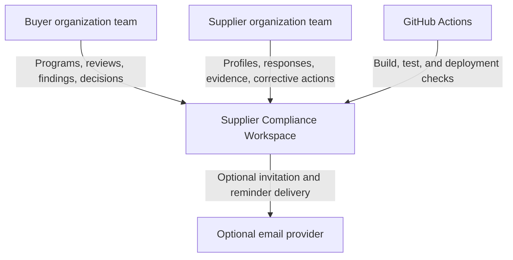

An email provider is optional. Notification records remain testable without
external delivery.

## Component view

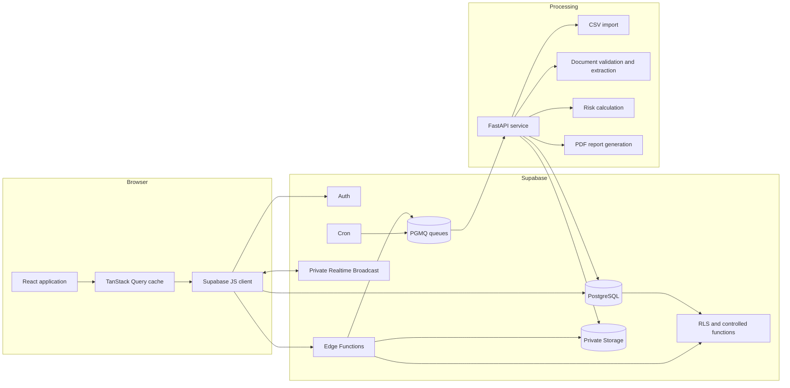

## Responsibility boundaries

| Component | Owns | Does not own |
| --- | --- | --- |
| React application | Navigation, accessible forms, drafts, query cache, role-aware controls | Authorization decisions, secret handling, arbitrary signed URLs |
| PostgreSQL | Relationships, RLS, constraints, immutable history, state transitions, audit records | Heavy PDF parsing or external delivery |
| Edge Functions | Authenticated commands, one-time tokens, exact-resource signed URLs, queue submission | Long-running document processing |
| FastAPI | Imports, deterministic validation, document metadata, text extraction, risk calculation, reports | Browser authentication UX or ordinary row CRUD |
| Queues and Cron | Durable handoff, retries, reminders, dead-letter routing | Business authorization without revalidation |
| Realtime | Small invalidation or status messages | Authoritative state or secret-bearing payloads |

## Authorization model

Access to relationship-owned data requires a valid path:

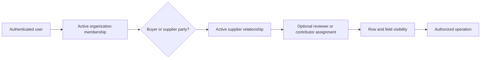

For example, a supplier user reading a finding must be an active member of the
supplier organization on that relationship. The finding must be supplier
visible, and buyer-internal fields must be absent from the supplier-facing query
shape. See
[relationship-authorization.md](docs/architecture/relationship-authorization.md).

## Core sequences

### Invitation acceptance

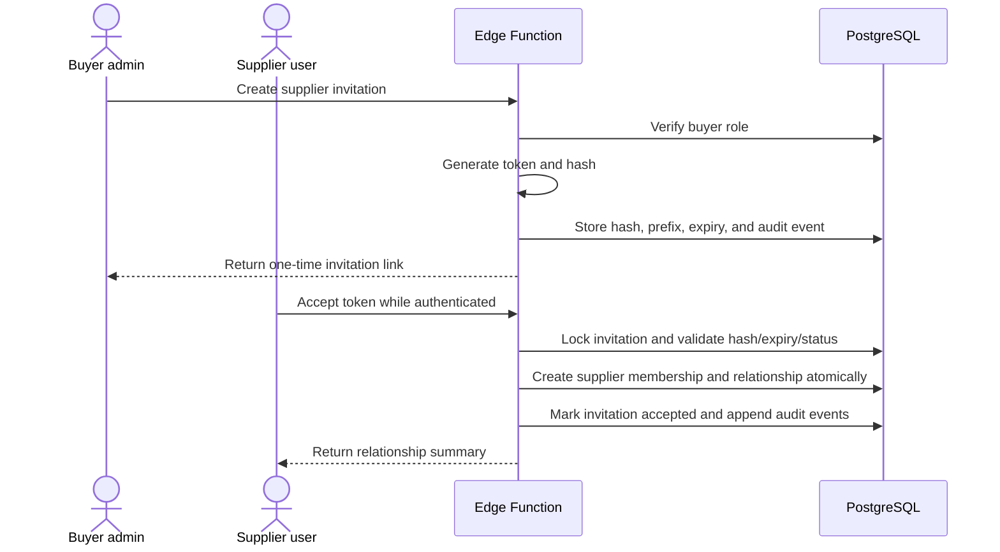

The plaintext token is never persisted or logged.

### Document upload and processing

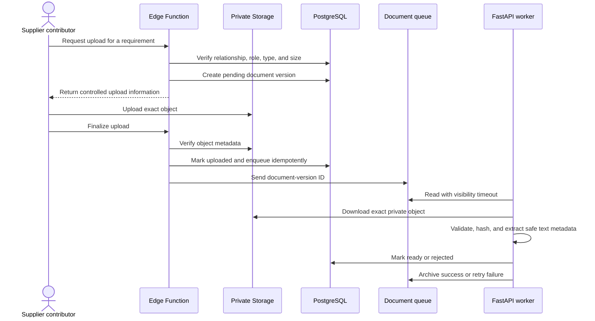

### Assessment submission and review

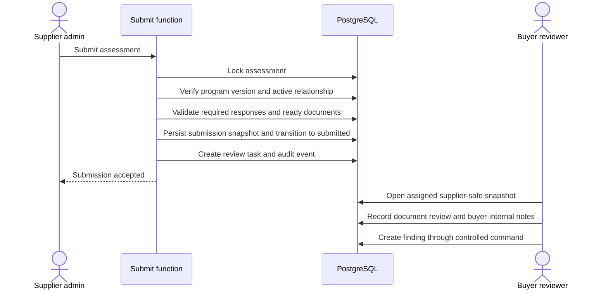

### Finding, corrective action, and decision

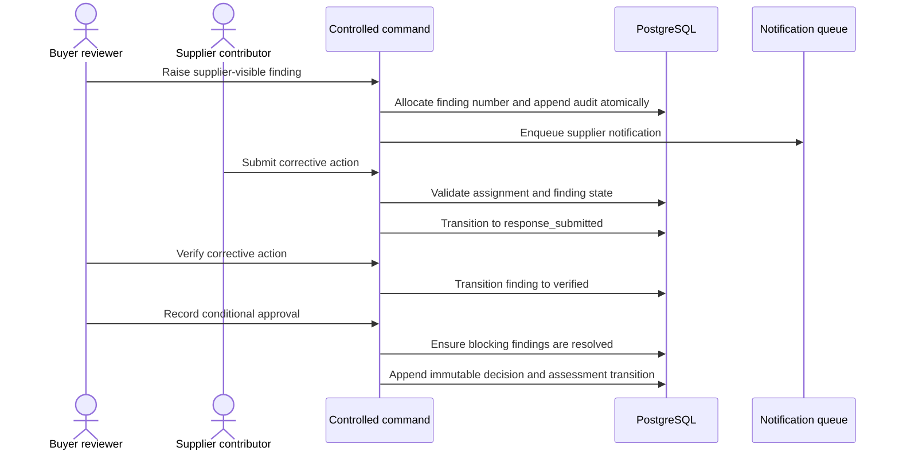

## State machines

### Assessment

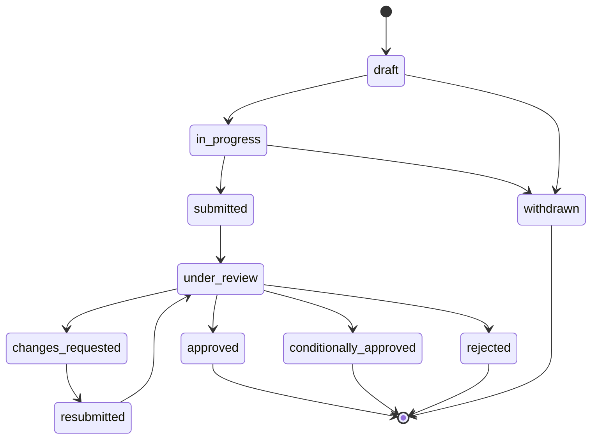

### Finding

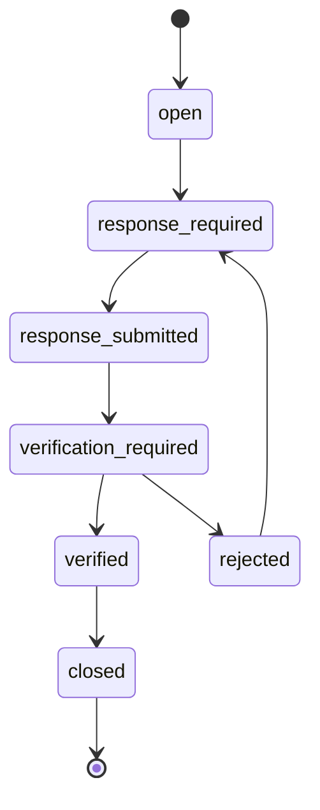

### Document version

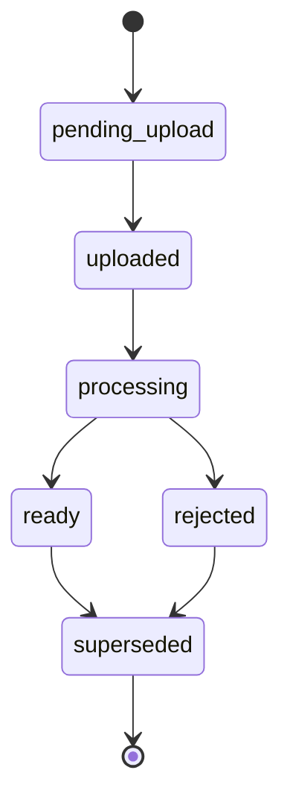

### Supplier relationship

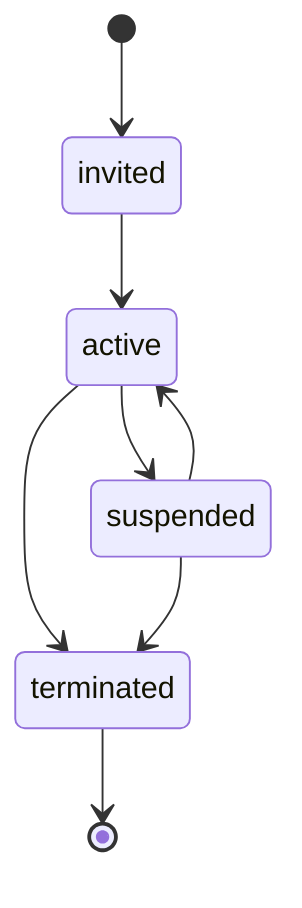

Critical transitions should execute in a transaction that locks the current row,
verifies the actor and current state, writes related timeline or audit records,
and rejects duplicate terminal actions.

## Versioning and immutability

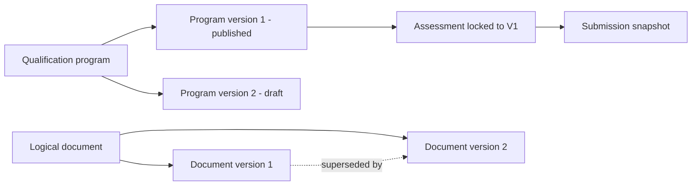

Published definitions, submitted snapshots, document versions, risk
evaluations, and approval decisions are historical records. New information is
appended with lineage rather than rewriting prior evidence.

## Queue architecture

| Queue | Producer | Consumer | Idempotency key | Dead-letter trigger |
| --- | --- | --- | --- | --- |
| `document_processing` | Finalize-upload command | FastAPI document worker | Document-version ID plus hash | Maximum processing attempts |
| `risk_recalculation` | Submission or relevant review change | FastAPI risk worker | Assessment ID plus calculation version | Repeated deterministic or transient failure |
| `report_generation` | Authorized report command | FastAPI report worker | Assessment ID plus decision version | Repeated generation or storage failure |
| `notification_delivery` | Domain commands and Cron | Notification worker | Notification ID | Maximum provider delivery attempts |

The target policy is:

- Messages become invisible during processing, not deleted on read.
- A successful worker archives or deletes the message only after committing the
  result.
- A failure records a bounded error summary and increments attempts.
- Transient errors use exponential backoff with jitter.
- Permanent validation failures move directly to a reviewable dead-letter
  record.
- Workers re-check authorization-relevant resource state before action.
- Correlation IDs connect queue, API, audit, and application logs.

Exact visibility timeouts and attempt limits must be set from measured worker
behavior and recorded in deployment configuration.

## Realtime design

Private topics:

- `buyer:{buyer_org_id}:relationships`
- `relationship:{relationship_id}:assessment`
- `relationship:{relationship_id}:findings`
- `organization:{organization_id}:notifications`

Broadcast payloads contain identifiers, event type, status, and timestamp only.
They exclude internal notes, risk breakdowns, document contents, signed URLs,
tokens, and full record snapshots. After reconnection, the web app invalidates
queries and refetches PostgreSQL-authoritative data.

## Failure handling

| Failure | Behavior |
| --- | --- |
| Invalid invitation token | Generic rejection without account enumeration |
| Incomplete assessment | Transaction aborted with field-safe validation details |
| Storage metadata mismatch | Version remains non-ready and is quarantined for review |
| Document parser failure | Bounded error recorded; content omitted from logs |
| Queue worker timeout | Message becomes visible for a later bounded retry |
| Realtime disconnect | UI marks stale state, reconnects, and refetches |
| Report upload failure | Report job retries without creating duplicate report versions |
| Authorization failure | Generic denial, structured audit signal where appropriate |

## Observability

Target logs are structured JSON with:

- event name
- service and version
- correlation ID
- resource type and opaque resource ID
- outcome and bounded error code
- duration

Logs must never include invitation tokens, signed URLs, passwords, service keys,
document contents, unrestricted questionnaire answers, or internal notes.

## Decisions

Architecture decisions are recorded in [`docs/decisions`](docs/decisions/README.md):

- Relationship-based authorization
- Edge Function and FastAPI responsibility split
- Immutable, versioned compliance records

## Known limitations

- This architecture is not implementation evidence.
- A Supabase project being available does not prove migrations, RLS, Storage,
  functions, Cron, queues, or Realtime are configured.
- PDF processing is restricted to small text-based demonstration files and is
  not a hardened malware-analysis sandbox.
- External email delivery is optional and not required for workflow tests.
- Scaling targets, availability objectives, and retention periods require actual
  load and operational data.
