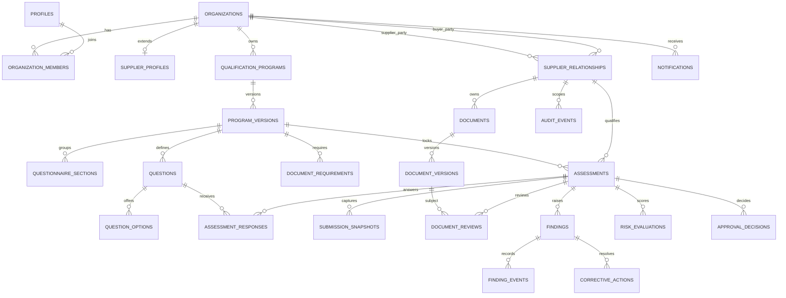

# Data Model

> **Document status:** Target schema specification. Table existence, constraints,
> policies, and query performance remain pending implementation and database
> verification.

## Modeling principles

- UUID primary keys and UTC timestamps.
- Direct `organization_id` ownership where possible.
- An indexed, unambiguous `supplier_relationship_id` path for shared records.
- Foreign keys, check constraints, and unique constraints for invariants.
- Explicit status values and controlled state transitions.
- Immutable published, submitted, and decided records.
- Private fields separated from supplier-safe read models.
- JSONB only for genuinely variable structures, not ordinary relationships.

## Relationship map

`SUBMISSION_SNAPSHOTS` is an explicit recommended addition to the base prompt.
It preserves the exact response and evidence references evaluated at each
submission or resubmission. The operational response tables may continue to
support drafts, while the snapshot remains immutable.

## Ownership domains

| Domain | Primary scope | Access path |
| --- | --- | --- |
| Identity | User and organization | Active organization membership |
| Program definition | Buyer organization | Buyer membership and buyer role |
| Relationship | Buyer plus supplier organization | Membership in either party and active relationship |
| Assessment | Supplier relationship and program version | Relationship access plus assignment or role |
| Evidence | Supplier relationship | Exact document version plus relationship access |
| Review | Assessment and buyer organization | Buyer role or reviewer assignment |
| Finding collaboration | Assessment and relationship | Party role plus supplier-visible field rules |
| Decision and risk | Assessment and buyer organization | Buyer-only unless an explicit safe summary is shared |
| Notification | Organization or user | Matching organization and recipient |
| Audit | Organization and optional relationship | Authorized read; append only through controlled operations |

## Entity catalogue

### Identity and tenancy

| Entity | Purpose | Key invariants |
| --- | --- | --- |
| `profiles` | Application profile for `auth.users` | Primary key equals Auth user ID |
| `organizations` | Buyer or supplier tenant | Valid organization type, unique slug |
| `organization_members` | User role in an organization | Unique organization-user pair; active state required for access |
| `supplier_profiles` | Supplier-specific company information | Exactly one profile per supplier organization |

### Relationships and invitations

| Entity | Purpose | Key invariants |
| --- | --- | --- |
| `supplier_relationships` | Connects one buyer to one supplier | Unique buyer-supplier pair; parties must have correct types |
| `supplier_invitations` | One-time supplier onboarding | Hash and prefix only; expiry; single acceptance |

### Versioned program definition

| Entity | Purpose | Key invariants |
| --- | --- | --- |
| `qualification_programs` | Buyer-owned qualification family | Current version belongs to same program |
| `program_versions` | Immutable published definition | Unique program-version number; one active version policy |
| `questionnaire_sections` | Ordered grouping | Belongs to one program version |
| `questions` | Typed requirement | Unique stable key within version |
| `question_options` | Enumerated values and risk score | Unique value within question |
| `document_requirements` | Evidence requirement | Unique stable key within version |

### Assessment and response history

| Entity | Purpose | Key invariants |
| --- | --- | --- |
| `assessments` | Qualification attempt | Relationship, program, and exact version agree |
| `assessment_responses` | Current draft response | Unique assessment-question pair; typed-value validation |
| `submission_snapshots` | Immutable submitted state | Unique assessment and submission number |
| `review_tasks` | Buyer review assignment | Reviewer belongs to buyer organization |

### Documents and reviews

| Entity | Purpose | Key invariants |
| --- | --- | --- |
| `documents` | Logical evidence item | Belongs to supplier and relationship |
| `document_versions` | Immutable file metadata | Unique document-version number; exact private path |
| `document_reviews` | Buyer review of exact version | Unique active review per assessment and version where required |

### Finding and decision constraints

| Entity | Purpose | Key invariants |
| --- | --- | --- |
| `findings` | Buyer-raised issue | Sequential number within assessment; internal note buyer-only |
| `finding_events` | Collaborative timeline | Explicit `supplier_visible` flag |
| `corrective_actions` | Supplier remediation | Supplier organization matches relationship |
| `risk_evaluations` | Versioned deterministic score | Prior evaluations are superseded, never rewritten |
| `approval_decisions` | Immutable buyer decision | Authorized buyer decision-maker only |

### Operations

| Entity | Purpose | Key invariants |
| --- | --- | --- |
| `notifications` | In-app and delivery state | Recipient must be in owning organization |
| `audit_events` | Security and business history | Ordinary users cannot insert, update, or delete |
| `queue_failures` | Reviewable dead-letter metadata | No document contents or secrets |

## Key constraints

### Organization type

- Buyer-side foreign keys reference organizations with type `buyer`.
- Supplier-side foreign keys reference organizations with type `supplier`.
- A relationship cannot connect an organization to itself.
- Membership roles must match the organization's type.

These cross-row constraints may require controlled functions or deferred
constraint triggers in addition to ordinary `CHECK` constraints.

### Program publication

- Draft versions may be edited by authorized buyer owners or administrators.
- Publishing requires at least one section and one valid requirement.
- Published or retired versions reject direct definition changes.
- `current_version_id` references an active version of the same program.
- A new version copies stable keys but receives a new version number.

### Typed responses

Only the response column corresponding to a question's `answer_type` may be
populated. A controlled validation function should reject:

- text stored for a Boolean question
- unknown option IDs
- options belonging to another question
- invalid date, number, or JSON shapes
- responses to questions outside the assessment's locked version

### Assessment submission

Submission requires:

- active supplier relationship
- authorized supplier actor
- current status `in_progress`, `changes_requested`, or allowed resubmission state
- all visible required questions answered
- required documents with a `ready` version
- supplier declaration
- transactional snapshot and status transition

### Document versioning

- Storage paths are generated server-side.
- `(document_id, version_number)` is unique.
- A ready or reviewed version is never overwritten.
- Replacing evidence inserts a new version and marks the prior version
  `superseded` only after the replacement is accepted by the workflow.
- Hash, MIME type, byte size, and dates describe the exact stored object.

### Findings and decisions

- Finding numbers are allocated under a lock per assessment.
- Supplier events expose only supplier-safe comments.
- A final decision cannot be recorded while unresolved blocking findings exist.
- Decision rows are immutable; a later decision references or supersedes the
  prior decision without deleting history.

## Field visibility

RLS filters rows, not individual columns. Sensitive fields therefore require a
supplier-safe view or controlled function result that omits protected columns.

| Field | Buyer | Supplier | Public |
| --- | --- | --- | --- |
| Supplier-facing finding description | Allowed | Allowed for own relationship | Denied |
| `findings.internal_note` | Authorized buyer only | Denied and absent from result shape | Denied |
| `document_reviews.reviewer_note` | Authorized buyer | Allowed only when intentionally supplier-facing | Denied |
| `document_reviews.internal_note` | Authorized buyer only | Denied and absent | Denied |
| `risk_evaluations.scoring_breakdown` | Authorized buyer only | Denied by default | Denied |
| `approval_decisions.conditions` | Authorized buyer | Allowed for own relationship | Denied |
| `approval_decisions.internal_rationale` | Authorized buyer only | Denied and absent | Denied |
| Invitation token hash | Narrow server operation only | Denied | Denied |
| Storage path | Controlled service use | Not accepted as signed-URL input | Denied |

## Index strategy

Indexes should support:

- active membership by `(user_id, organization_id, membership_status)`
- buyer and supplier relationship lookup
- assessment status by relationship, reviewer, and supplier assignee
- current program version and stable requirement keys
- document expiry and processing status
- open findings and due dates
- unread notifications by organization or user
- audit timelines by organization, relationship, resource, and timestamp
- queue work by status and availability time

Partial indexes are appropriate for active memberships, open findings, pending
notifications, and nonterminal assessments. Query plans must be measured before
adding overlapping indexes.

## Deletion and retention

The target system favors status changes and retention over destructive deletion:

- Terminating a relationship preserves assessment history.
- Retiring a program version preserves linked assessments.
- Replacing a document preserves prior versions.
- Closing a finding preserves events and corrective actions.
- Audit records are retained according to a documented policy.

Retention durations and legal deletion procedures are operational policy
decisions and remain pending.

## Fixture identifiers

Files in [`tests/fixtures`](tests/fixtures/README.md) use deterministic UUIDs and
timestamps so database, API, and E2E assertions can share the same scenario.
These identifiers are fictional and must never be reused as credentials.
