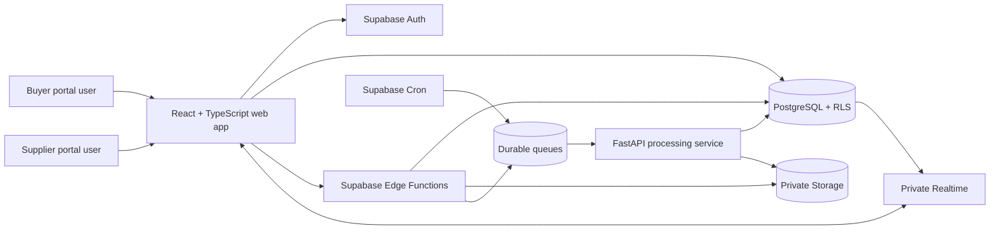

# Supplier Compliance Workspace

> **Current status:** Documentation and synthetic test fixtures are in place.
> Application implementation, automated product tests, hosted deployment, and
> screenshots remain **pending verification**.

An independently designed reference implementation for secure buyer-and-supplier
qualification workflows. The target system combines relationship-based
authorization, versioned questionnaires, private evidence, findings, corrective
actions, approvals, reminders, and audit history in one multi-tenant workspace.

This is a portfolio project for Kartik Mishra. It is not client work, does not
represent prior production use, and contains only fictional demonstration data.

## 30-second overview

| Question | Answer |
| --- | --- |
| What problem does it address? | Supplier qualification is often fragmented across email, spreadsheets, file shares, and disconnected review notes. |
| Who uses it? | Buyer owners, buyer reviewers, supplier administrators, supplier contributors, and read-only stakeholders. |
| What makes it technically meaningful? | Access depends on organization membership **and** an active buyer-supplier relationship; buyer-internal fields must never leak to suppliers. |
| What is the core workflow? | Publish program, invite supplier, collect responses and evidence, review, raise findings, verify corrective action, record a decision, and monitor expiry. |
| What is implemented now? | Architecture, security, data-model, testing, deployment, and portfolio documentation plus deterministic synthetic fixtures. |
| What is not yet verified? | Product code, migrations, RLS policies, Edge Functions, FastAPI, UI, E2E tests, public deployment, and CI results. |

## Product problem

Supplier onboarding combines collaborative work with strict confidentiality:

- Buyers define qualification programs and evaluate supplier evidence.
- Suppliers answer questionnaires and maintain versioned documents.
- Reviewers record findings and internal risk assessments.
- Both sides collaborate on corrective actions.
- Buyer-only notes, scores, and rationale must remain private.
- Every meaningful transition needs an attributable audit trail.

Simple `organization_id` filtering is insufficient because access to shared
records depends on a specific relationship between one buyer and one supplier.
The target authorization model therefore evaluates membership, role,
organization type, relationship state, assignment, and field visibility.

## Demonstration workflow

The reproducible scenario uses only fictional entities:

1. **Apex Components Group** publishes version 1 of the **Standard Supplier
   Qualification** program.
2. Apex invites **Nova Plastics Ltd.**
3. Nova accepts and assigns a supplier contributor.
4. An incomplete assessment is blocked from submission.
5. Nova completes the missing response and uploads fictional evidence.
6. Apex requests a replacement for one document version.
7. Nova uploads a new immutable version.
8. Apex raises a medium-severity finding.
9. Nova submits a corrective action.
10. Apex verifies the action and conditionally approves Nova.
11. A scheduled job creates a document-expiry reminder.
12. **Greenline Packaging Works** is denied access to Nova's relationship,
    documents, internal notes, and risk calculation.

Synthetic fixtures supporting this sequence live in
[`tests/fixtures`](tests/fixtures/README.md).

## Target capabilities

### Buyer workspace

- Build and publish versioned qualification programs.
- Invite suppliers and assign reviewers.
- Review responses and private evidence.
- Keep internal notes and risk scores buyer-only.
- Raise findings, verify corrective actions, and record decisions.

### Supplier workspace

- Accept a buyer invitation and maintain a supplier profile.
- Complete assigned questionnaires with conditional validation.
- Upload evidence without public object URLs.
- Replace documents without overwriting history.
- Respond to findings and track approval status.

### Platform controls

- PostgreSQL-enforced relationship authorization and state transitions.
- Private Supabase Storage with short-lived, authorized signed URLs.
- Edge Functions for identity-sensitive transactional commands.
- FastAPI workers for document processing, imports, risk calculation, and PDF
  report generation.
- Durable queues with bounded retries and dead-letter handling.
- Private Realtime channels containing only supplier-safe event summaries.
- Append-only audit history for ordinary users.

## Target architecture



The browser performs ordinary authorized reads and drafts through Supabase. Edge
Functions own sensitive, transactional commands. FastAPI handles heavier,
server-only processing. See [ARCHITECTURE.md](ARCHITECTURE.md).

## Security model

The target system follows four rules:

1. **Relationship before record:** shared data is visible only through an active
   buyer-supplier relationship and active organization membership.
2. **Roles are enforced in PostgreSQL:** hidden buttons are usability controls,
   not the authorization boundary.
3. **Rows do not solve column secrecy:** supplier-safe views or narrowly scoped
   functions must exclude buyer-internal notes, scoring, and rationale.
4. **Files remain private:** clients request a signed URL for an exact authorized
   document version; arbitrary paths are never signed.

Detailed controls and the pending verification checklist are in
[SECURITY.md](SECURITY.md).

## Versioning strategy

- Published program versions become immutable.
- Assessments remain linked to the version under which they started.
- Submitted responses are captured as an immutable submission snapshot.
- Document replacement creates a new document version.
- Risk calculations and approval decisions are appended, not rewritten.
- Amendments create new records with explicit lineage.

See [DATA_MODEL.md](DATA_MODEL.md) and
[versioning-and-immutability.md](docs/architecture/versioning-and-immutability.md).

## Intended technology stack

| Layer | Technology |
| --- | --- |
| Web | React, TypeScript, Vite, React Router, TanStack Query, Zod |
| Platform | Supabase Auth, PostgreSQL, RLS, Storage, Edge Functions, Realtime, Queues, Cron |
| Processing | Python, FastAPI, Pydantic, structured logging |
| Tests | pgTAP, Deno test, Pytest, Vitest, React Testing Library, Playwright |
| Delivery | Docker, GitHub Actions, SQL migrations, generated TypeScript database types |

Versions must be pinned by implementation files before this table is treated as
verified build evidence.

## Repository map

```text
apps/web/                 React buyer and supplier portals (target)
services/api/             FastAPI processing service (target)
supabase/                 Migrations, functions, tests, and seed data (target)
packages/                 Shared contracts and generated types (target)
tests/e2e/                Critical browser workflows (target)
tests/fixtures/           Synthetic machine-readable fixtures
tests/sample-documents/   Safe source material for generated test PDFs
docs/                     Architecture, security, operations, and decisions
```

## Local setup

The commands below are the **intended interface**. They must not be interpreted
as verified until the corresponding source files and toolchain are present and
the results are recorded in [TEST_REPORT.md](TEST_REPORT.md).

```bash
cp .env.example .env
supabase start
supabase db reset
npm ci
python -m venv services/api/.venv
services/api/.venv/bin/pip install -r services/api/requirements-dev.txt
npm run dev
```

Never commit `.env`. Demo-user passwords and server credentials must be supplied
at runtime.

## Intended quality gates

```bash
npm run format:check
npm run lint
npm run typecheck
npm test
npm run test:e2e
services/api/.venv/bin/python -m pytest services/api
supabase test db
deno test --allow-env supabase/functions
docker compose build
```

Actual commands, counts, failures, and skips belong in
[TEST_REPORT.md](TEST_REPORT.md). Configuration alone is not a passing test.

## Documentation

| Document | Purpose |
| --- | --- |
| [ARCHITECTURE.md](ARCHITECTURE.md) | Components, authorization, sequences, state machines, and queue design |
| [DATA_MODEL.md](DATA_MODEL.md) | Entities, ownership paths, constraints, indexes, and sensitive-field rules |
| [SECURITY.md](SECURITY.md) | Threat model, RLS, Storage, token, parsing, and secret controls |
| [TESTING.md](TESTING.md) | Test strategy, fixture use, required denial cases, and execution procedure |
| [DEPLOYMENT.md](DEPLOYMENT.md) | Local and hosted rollout procedure with rollback and verification gates |
| [PORTFOLIO_NOTES.md](PORTFOLIO_NOTES.md) | Truthful recruiter walkthrough and interview-ready explanations |
| [docs/decisions](docs/decisions/README.md) | Architecture decision records |

## Screenshots

No screenshots are included yet. Only genuine application output captured after
implementation and verification may be added. The required capture checklist is
in [`docs/screenshots/README.md`](docs/screenshots/README.md).

## Portfolio summary

> Supplier Compliance Workspace is an independent reference design for a
> multi-tenant buyer-and-supplier qualification platform. It models versioned
> programs, private document evidence, relationship-based authorization,
> findings, corrective actions, approval decisions, reminders, and auditable
> state transitions using React, FastAPI, PostgreSQL, and Supabase.

At the current repository stage, the safe claim is that the architecture,
security model, test strategy, and synthetic fixtures have been designed. Claims
about working software, test results, deployment, or production readiness require
later evidence.

## Ethical use and limitations

- All organizations, people, identifiers, answers, documents, and events are
  synthetic.
- This project is not a certification, legal opinion, audit service, or complete
  vendor-risk platform.
- The target PDF flow supports small text-based demonstration documents only.
  OCR and active-content execution are intentionally excluded.
- Realtime events are delivery hints; PostgreSQL remains authoritative.
- A local container is not a hardened sandbox for malicious document processing.
- No external customer, employer, or platform has endorsed this project.
