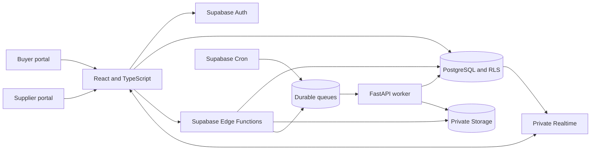
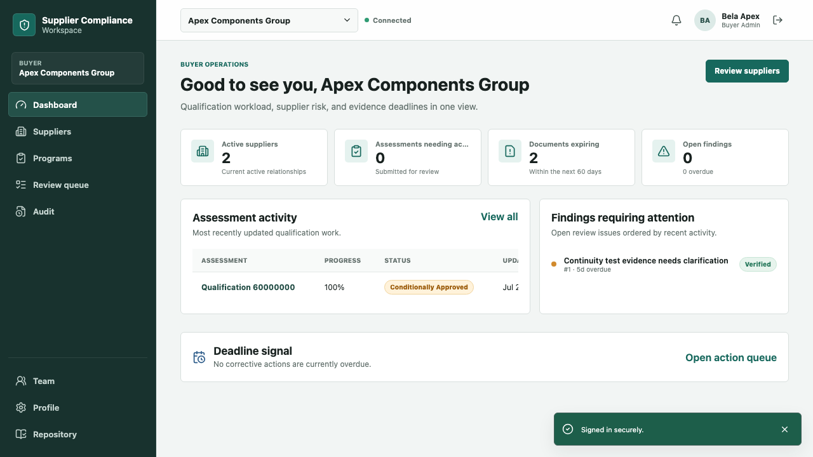
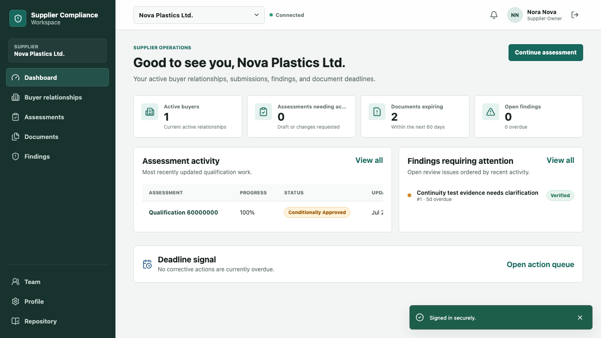
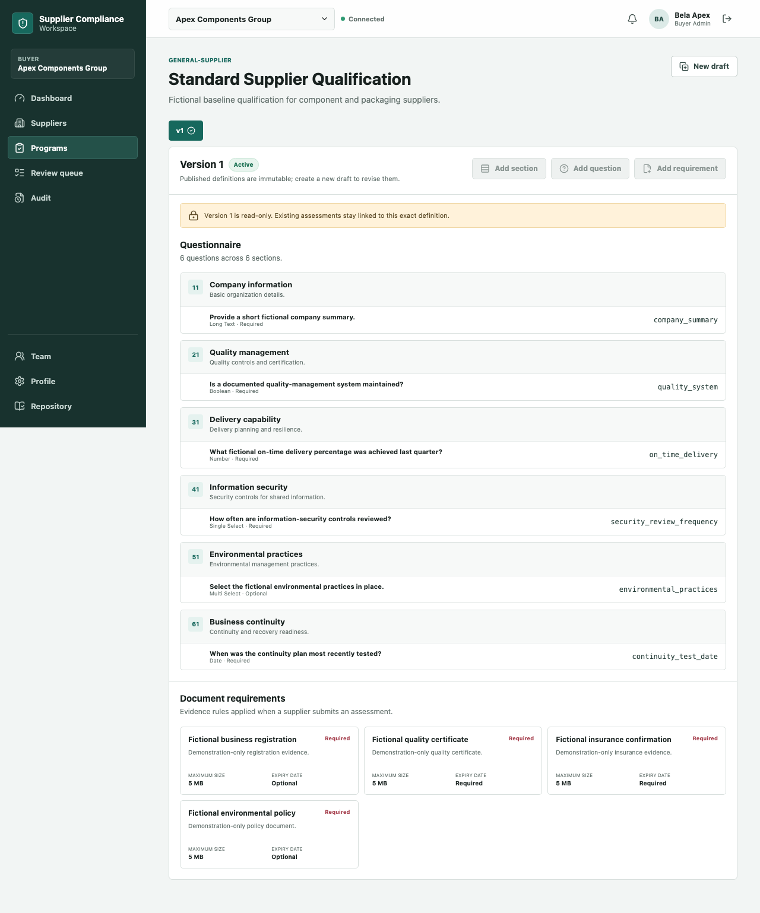
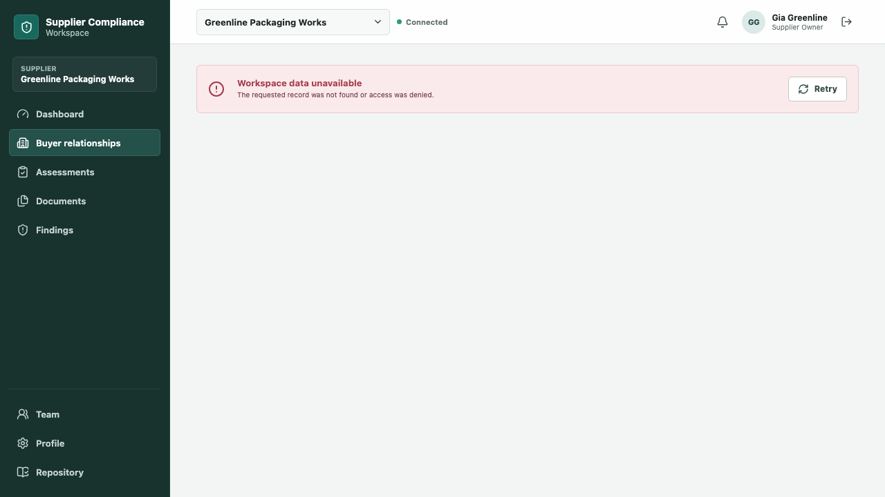

# Supplier Compliance Workspace

[Live application](https://supplier-compliance-workspace.zw386.chatgpt.site) |
[Architecture](ARCHITECTURE.md) |
[Test evidence](TEST_REPORT.md) |
[Deployment status](DEPLOYMENT_REPORT.md)

An independently designed multi-tenant reference implementation for buyer and
supplier qualification. It combines versioned questionnaires, private evidence,
findings, corrective actions, approval decisions, reminders, and audit history
with relationship-aware authorization.

> **Verified status:** The React application and dedicated Supabase backend are
> publicly deployed. Hosted Auth, PostgreSQL RLS, private Storage, 11 Edge
> Functions, queues, Cron, and private Realtime were tested with fictional
> accounts. The FastAPI worker is fully tested and container-verified, but is not
> publicly hosted because no authenticated container provider was available.

This is a portfolio reference project for Kartik Mishra. It is not client work,
does not represent prior production use, and contains only synthetic data.

## 30-second overview

| Question | Answer |
| --- | --- |
| Problem | Supplier qualification is often fragmented across email, spreadsheets, file shares, and disconnected review notes. |
| Users | Buyer owners, reviewers, supplier administrators, contributors, and read-only stakeholders. |
| Core workflow | Publish program, invite supplier, collect responses and evidence, review, raise findings, verify corrective action, and record a decision. |
| Technical focus | Relationship-based RLS, field confidentiality, immutable versions, private files, transactional state changes, durable jobs, and reproducible tests. |
| Live state | Public web app plus a dedicated healthy Supabase project in `eu-central-1`. |
| Honest limitation | Hosted background processing awaits a public FastAPI container host; the complete workflow is verified locally and in Docker. |

## Working product

### Buyer workspace

- Dashboard for relationships, review queues, findings, expiry risk, and activity.
- Versioned qualification-program builder with immutable published versions.
- Response and evidence review with buyer-only notes.
- Finding creation, corrective-action verification, and approval decisions.
- Filterable audit history and private notification updates.

### Supplier workspace

- Relationship and assessment dashboards.
- Typed questionnaire responses with completeness validation.
- Private evidence upload with immutable document versions.
- Supplier-visible findings and corrective-action submission.
- Explicit denial of buyer-internal notes and risk calculations.

### Platform controls

- Eight buyer and supplier roles enforced in PostgreSQL.
- Private Storage with exact-record, short-lived signed URLs.
- One-time invitation tokens stored only as secure hashes.
- Eleven Edge Functions for transactional identity-sensitive commands.
- Durable document, risk, report, and notification queues.
- Low-frequency Cron reminders and retry consumers.
- Private Realtime Broadcast channels with minimal invalidation payloads.
- Append-only audit history for ordinary users.

## Architecture



The browser performs ordinary authorized reads and drafts through Supabase.
Edge Functions own sensitive transactional commands. FastAPI handles heavier,
server-only processing. Queue messages contain record IDs and correlation IDs,
not document contents or credentials. See [ARCHITECTURE.md](ARCHITECTURE.md).

## Demonstration workflow

The reproducible scenario uses fictional organizations only:

1. **Apex Components Group** publishes version 1 of **Standard Supplier
   Qualification**.
2. Apex invites **Nova Plastics Ltd.**
3. Nova accepts and receives a relationship-scoped workspace.
4. An incomplete assessment is blocked.
5. Nova completes responses and uploads fictional evidence.
6. Apex requests a replacement without overwriting the original version.
7. Apex raises a finding and Nova submits a corrective action.
8. Apex verifies the action and conditionally approves Nova.
9. A report and expiry notification are generated.
10. **Greenline Packaging Works** is denied Nova's records, files, private
    channels, internal notes, and risk calculation.

## Security model

1. **Relationship before record:** access requires active membership on the
   exact buyer or supplier side of a relationship.
2. **PostgreSQL is the boundary:** frontend controls improve usability, while
   RLS and transactional functions enforce permissions.
3. **RLS does not solve column secrecy:** supplier-safe views omit buyer-only
   notes, risk details, and rationale.
4. **Files remain private:** the caller requests a URL for a document-version
   ID; user-supplied paths are never signed.
5. **Sensitive actions are auditable:** workflow transitions append redacted
   audit events in the same controlled operation.

The hosted verifier proved anonymous denial, cross-supplier isolation,
internal-field confidentiality, private bucket configuration, Edge
authorization, private-channel denial, and live authorized Broadcast delivery.
See [SECURITY.md](SECURITY.md).

## Versioning

- Published program versions cannot be edited.
- Assessments remain linked to their starting version.
- Submission snapshots preserve the reviewed responses.
- Evidence replacement creates a new document version.
- Risk evaluations and approval decisions append history.
- Audit events are immutable to ordinary authenticated roles.

## Genuine screenshots

| Buyer dashboard | Supplier dashboard |
| --- | --- |
|  |  |

| Program builder | Cross-tenant denial |
| --- | --- |
|  |  |

All nine screenshots were recaptured from the public deployment by the hosted
Playwright suite. No password, token, signed URL, or private key is visible.

## Technology

| Layer | Technology |
| --- | --- |
| Web | React 19, TypeScript 6, Vite 8, React Router, TanStack Query, Zod |
| Platform | Supabase Auth, PostgreSQL 17, RLS, Storage, Edge Functions, Realtime, Queues, Cron |
| Processing | Python 3.11+, FastAPI, Pydantic, pypdf, ReportLab |
| Tests | pgTAP, Deno test, Pytest, Vitest, React Testing Library, Playwright |
| Delivery | Docker Compose, Nginx, GitHub Actions, SQL migrations, Sites |

Verified workstation toolchains are recorded in
[TEST_REPORT.md](TEST_REPORT.md).

## Repository map

```text
apps/web/                 React buyer and supplier portals
services/api/             FastAPI processing service
supabase/migrations/      Reproducible PostgreSQL platform
supabase/functions/       Authenticated Edge Functions and shared controls
supabase/tests/           pgTAP schema, RLS, Storage, workflow, and Realtime tests
packages/contracts/       Shared contracts and generated database types
tests/e2e/                Desktop and mobile browser workflows
tests/fixtures/           Deterministic synthetic datasets
tests/sample-documents/   Safe fictional PDF source material
docs/                     Architecture, security, decisions, and screenshots
```

## Quick start

Prerequisites: Docker, Node.js 24, Python 3.11+, and the Supabase CLI.

```bash
cp .env.example .env
make setup
make db-start
make db-reset
make test
make build
docker compose up --build
```

Environment-controlled demo passwords are required for authenticated browser
tests. No universal demo password is committed.

### Quality commands

```bash
make lint
make typecheck
make test
make build
make e2e
make verify
node scripts/check-secrets.mjs
python3 docs/validation/validate_portfolio_slice.py
```

The complete application flow can be exercised with
`node scripts/verify-platform.mjs` after supplying the variables documented in
`.env.example`.

## Verified results

| Area | Result |
| --- | ---: |
| Local pgTAP | 227 passed |
| Hosted pgTAP | 227 passed |
| Edge Functions | 21 passed |
| FastAPI | 84 passed |
| Frontend | 26 passed |
| Local Playwright | 9 passed, 1 intentional skip |
| Hosted Playwright | 9 passed, 1 intentional skip |
| Documentation validator | 0 errors |
| npm audit | 0 vulnerabilities |
| pip-audit | 0 known vulnerabilities in auditable dependencies |
| Secret scan | Standard build (293 files) and Sites build (296 files) passed |
| Docker | API and web images built and reported healthy |

See [TEST_REPORT.md](TEST_REPORT.md) for commands, scope, and limitations.

## Deployment

- Web: [supplier-compliance-workspace.zw386.chatgpt.site](https://supplier-compliance-workspace.zw386.chatgpt.site)
- Supabase: dedicated hosted project with seven applied migrations and eleven
  deployed Edge Functions
- FastAPI: tested locally and in a nonroot Docker image; public deployment is
  pending provider authentication

Public reviewer credentials are intentionally not stored in this repository.
The screenshots and source provide an inspectable walkthrough; hosted account
access can be granted through the controlled invitation flow.

## Portfolio summary

> Built and deployed an independent multi-tenant supplier qualification
> reference application using React, FastAPI, PostgreSQL, and Supabase.
> Implemented relationship-based RLS, private versioned evidence, transactional
> invitation and review workflows, durable processing, private Realtime, and
> automated cross-tenant tests using synthetic data.

## Limitations and ethical use

- All organizations, people, identifiers, documents, and events are synthetic.
- The project is not a legal opinion, certification, audit service, or complete
  vendor-risk product.
- OCR, malware scanning, external email delivery, and active document content
  are intentionally excluded.
- Hosted background jobs cannot complete until FastAPI receives a public
  container deployment.
- Realtime is an invalidation mechanism; PostgreSQL remains authoritative.
- No customer, employer, client, or platform commissioned or endorsed this
  project.
