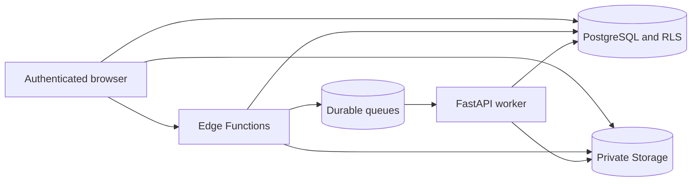

# Security

**Review date:** 2026-07-24

**Status:** Implemented and tested for the documented synthetic portfolio scope

This report is not a certification or penetration-test report. It records the
controls and verification completed for this independent reference
implementation.

## Security objectives

1. Prevent access outside active organizations and supplier relationships.
2. Keep buyer-internal notes, risk details, and rationale hidden from suppliers.
3. Keep evidence private and sign only exact authorized objects.
4. Prevent role escalation and invalid workflow transitions.
5. Store invitation tokens as nonrecoverable hashes.
6. Preserve append-only audit history for ordinary users.
7. Process fictional documents without executing embedded content.
8. Keep server credentials out of browsers, logs, commits, and screenshots.

## Trust boundaries



Browser input, CSV imports, invitation tokens, and uploaded documents are
untrusted. Publishable Supabase configuration may appear in the frontend;
service-role, database, deployment, and internal API credentials are
server-only.

## Controls and evidence

| Threat | Control | Verification |
| --- | --- | --- |
| Anonymous data access | Business tables are not granted to `anon` | Hosted request returned PostgreSQL `42501` |
| Cross-supplier disclosure | Relationship-aware RLS and indexed helper functions | Greenline received zero Nova rows and direct-URL denial |
| Internal-field leakage | Restricted base grants and supplier-safe views | Hosted and browser tests observed `internal_note` as absent or null |
| Role escalation | Membership changes through controlled functions | pgTAP role-escalation tests |
| Invalid workflow state | Transactional functions lock and validate expected state | Legal and illegal transition suites |
| Invitation replay | High-entropy one-time token, hash and prefix only, expiry | Deno and pgTAP invitation tests |
| Arbitrary file signing | Server resolves an authorized document-version ID | Cross-tenant and arbitrary-path Edge tests |
| Public evidence | Private buckets and relationship Storage policies | Hosted bucket inspection and pgTAP |
| Private-channel snooping | Topic authorization through `realtime.messages` RLS | Hosted cross-tenant subscription reached `CHANNEL_ERROR` |
| Secret leakage | Structured redaction, `.env` exclusion, source and bundle scan | Standard and Sites builds passed with zero findings |

## PostgreSQL and RLS

- RLS is enabled on application tables.
- Active organization membership is required before relationship checks.
- Buyer and supplier access follow separate indexed relationship paths.
- Suspended relationships deny ordinary supplier access while preserving data.
- Mutations are narrowed by role, assignment, workflow state, and organization
  type.
- Published definitions and submitted snapshots are immutable.
- Ordinary users cannot write audit records directly.
- `SECURITY DEFINER` functions set explicit safe search paths and expose narrow
  contracts.

The local and hosted pgTAP suites each passed 227 tests.

## Field confidentiality

RLS filters rows, not selected columns. The application therefore reads
supplier-sensitive domains through:

- `findings_visible`
- `document_reviews_visible`
- `risk_evaluations_visible`
- `approval_decisions_visible`

Supplier results exclude internal notes, scoring breakdowns, and rationale.
Frontend error handling also maps authorization and not-found responses to a
neutral message that does not reveal record existence.

## Storage

- `supplier-evidence` and generated-report buckets are private.
- Paths are derived from authorized database records.
- Upload reservations validate extension, MIME type, size, checksum, and dates.
- Finalization verifies the actual object against reserved metadata.
- Signed URLs are short-lived and generated for an exact version record.
- Replacements create immutable versions.
- Unrelated organizations cannot list, sign, or download evidence.

## Edge Functions

- User identity comes from the bearer session, not request body claims.
- Zod-style validation bounds strings, dates, sizes, and UUIDs.
- CORS is allowlisted to the deployed app and local development origins.
- Errors use stable codes without token, payload, or policy detail.
- Logs carry correlation IDs and redacted metadata.
- Invitation tokens are returned once and never logged.
- Service-role operations repeat business authorization in controlled database
  functions.

## Queues and document processing

- Queue bodies contain record and correlation IDs only.
- Reads use visibility timeouts, bounded retries, and explicit deletion after
  success.
- Exhausted messages move to dead-letter queues.
- Consumers are idempotent and update processing state.
- PDF processing supports small text-based demonstration PDFs only.
- Embedded content is not executed and document text is not logged.

Hosted worker execution remains disabled until a public FastAPI host is
configured. Messages retain failure and retry evidence rather than being
acknowledged falsely.

## Dependency and secret review

```text
npm audit --audit-level=high: 0 vulnerabilities
pip-audit --local: no known vulnerabilities in auditable dependencies
secret scan: 293 standard-build files and 296 Sites-build files, 0 findings
```

The local unpublished `supplier-compliance-api` package is not on PyPI and was
the only `pip-audit` skip. The Python installer was upgraded from a vulnerable
workstation version to fixed `pip 26.1.2`; build tooling is pinned to
`setuptools 83.0.0`. The container and security workflow install the same fixed
versions before application dependencies.

## Browser bundle review

The production bundle was scanned after building with hosted configuration.
Only the Supabase URL, publishable key, and non-secret API URL are client-side.
No service-role key, database password, internal token, demo password, signed
URL, or private storage path was found.

## Known limitations

- No formal external penetration test is claimed.
- No malware scanner, OCR engine, external email provider, WAF tuning, or SIEM
  export is included.
- Local Docker is not a hardened sandbox for malicious files.
- Availability, load, recovery, and backup-restore objectives are not measured.
- Public FastAPI deployment and hosted queue completion remain pending.

Security reports should be sent through the private process described in
[docs/security/responsible-disclosure.md](docs/security/responsible-disclosure.md).
