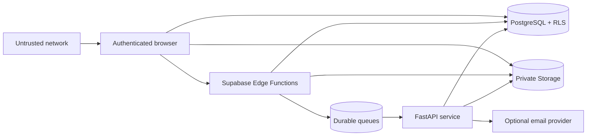

# Security

> **Review status:** Security design documented. Implementation review, database
> policy tests, dependency scans, built-asset scans, and hosted verification are
> **pending**. This document is not a certification or penetration-test report.

## Security objectives

1. Prevent access outside a user's active organizations and supplier
   relationships.
2. Keep buyer-internal notes, scores, and rationale hidden from suppliers.
3. Keep supplier evidence private and sign only exact authorized objects.
4. Prevent role escalation and unauthorized workflow transitions.
5. Store one-time credentials and invitations as nonrecoverable hashes.
6. Preserve trustworthy, append-only audit history for ordinary users.
7. Process untrusted demonstration documents without executing embedded content.
8. Keep server credentials out of browsers, logs, commits, reports, and
   screenshots.

## Trust boundaries



- Browser input, uploaded files, invitation tokens, and CSV imports are
  untrusted.
- Supabase publishable configuration is allowed in the browser; secret and
  service-role credentials are server-only.
- Edge Functions and FastAPI do not bypass business checks merely because they
  can use elevated credentials.
- Queue messages are pointers to records, not containers for document content or
  secrets.

## Threat model summary

| Threat | Example | Required control | Verification |
| --- | --- | --- | --- |
| Cross-tenant disclosure | Greenline requests Nova's assessment by UUID | Relationship-aware RLS and direct-URL denial tests | pgTAP and Playwright |
| Field-level disclosure | Supplier selects buyer `internal_note` | Supplier-safe views or RPC result shapes; base-table grants restricted | Database tests and response inspection |
| Role escalation | Contributor updates membership role | Membership mutation through controlled owner/admin function | pgTAP negative tests |
| Token theft | Invitation token appears in logs or database | High-entropy token, hash-only storage, one-time reveal, bounded expiry | Deno tests and secret/log review |
| Arbitrary file signing | User submits another tenant's Storage path | Resolve artifact by record ID; generate path server-side | Edge tests |
| Path traversal | Crafted filename escapes expected prefix | Ignore client path; sanitize filename; exact path format | Unit and Edge tests |
| Document parser abuse | Malformed PDF triggers execution or resource exhaustion | No active-content execution, type/size/time limits, isolated process where available | Pytest and operational review |
| Replay or duplicate command | Invitation accepted twice or decision repeated | Row lock, idempotency key, terminal-state guard | Database and Edge tests |
| Queue data leakage | Full questionnaire or document text in message | Opaque IDs and bounded metadata only | Queue payload inspection |
| Realtime leak | Buyer-internal note broadcast to supplier | Private channel authorization and minimal event schema | pgTAP/Deno/E2E |
| Audit tampering | User deletes an unfavorable event | No ordinary insert/update/delete grants; controlled append | pgTAP |
| Secret in frontend | Service key included in Vite bundle | Build scan and strict environment allowlist | CI secret scan |

The detailed threat register is in
[`docs/security/threat-model.md`](docs/security/threat-model.md).

## Relationship-based RLS

Shared records do not belong to every member of a buyer or supplier ecosystem.
They belong to one explicit relationship.

Target helper functions should answer narrowly scoped questions:

- `is_active_member(organization_id)`
- `organization_role(organization_id)`
- `has_buyer_role(organization_id, minimum_role)`
- `has_supplier_role(organization_id, minimum_role)`
- `can_access_relationship(relationship_id)`
- `is_assigned_reviewer(assessment_id)`
- `can_edit_assessment(assessment_id)`

Every helper must:

- derive the user from `auth.uid()`
- require active membership
- verify organization type
- account for suspended or terminated relationships
- set a safe `search_path` when `SECURITY DEFINER` is unavoidable
- avoid accepting a user ID as a trusted authorization argument
- have explicit execute grants
- be covered by positive and negative pgTAP tests

Example access logic:

```text
allow relationship read when:
  active membership in relationship.buyer_organization_id
  OR
  active membership in relationship.supplier_organization_id

allow supplier response edit when:
  active membership in relationship.supplier_organization_id
  AND relationship.status = active
  AND role permits contribution
  AND assessment is in an editable state
  AND question belongs to assessment.program_version_id
```

The complete model is described in
[`relationship-authorization.md`](docs/architecture/relationship-authorization.md).

## Field-level confidentiality

PostgreSQL RLS is row-level, not column-level. A policy that allows a supplier to
read a finding row would also expose every selected column unless grants and
query surfaces are designed separately.

Target controls:

- Revoke supplier-facing access to base tables containing protected fields.
- Expose supplier-safe views or controlled functions that omit protected
  columns.
- Keep view ownership and `security_invoker` behavior explicit.
- Separate supplier-visible timeline comments from buyer-internal notes.
- Return risk and decision summaries through purpose-specific result types.
- Add tests that query with the same grants and JWT claims used by the browser.

Protected examples:

- `document_reviews.internal_note`
- `findings.internal_note`
- `risk_evaluations.scoring_breakdown`
- `approval_decisions.internal_rationale`

## Authentication and authorization

- Supabase Auth provides identity; application roles come only from active
  membership rows.
- A user may have different roles in different organizations.
- No role is trusted from browser state or route parameters.
- Removed or suspended members lose access without waiting for a new frontend
  release.
- Invitations require authentication before acceptance.
- Sensitive commands re-check authorization in the same transaction as the
  mutation.

## Token handling

Invitation tokens:

- generated with a cryptographically secure random source
- at least 128 bits of entropy
- plaintext shown or sent once
- stored as a strong hash plus short identification prefix
- compared without logging plaintext
- expire and are single-use
- invalid responses avoid account enumeration

Do not use a general-purpose fast hash alone for low-entropy secrets. Token
entropy, keyed hashing strategy, and implementation library must be reviewed
before release.

## Private Storage

Target bucket classes:

- supplier evidence
- generated assessment reports
- optional profile assets

Evidence path format:

```text
buyer-organization-id/
  supplier-relationship-id/
    document-id/
      version-number/
        sanitized-filename
```

Security rules:

- All evidence and reports use private buckets.
- Paths are generated from authorized database records, never trusted from
  clients.
- Upload initialization checks relationship, role, requirement, MIME type, and
  declared size.
- Finalization verifies the object exists and matches expected metadata.
- A short-lived download URL is signed only for an exact authorized version.
- Replacing evidence creates a new path and database version.
- Historical accepted versions cannot be deleted by supplier contributors.
- Storage object policies mirror relationship access and are tested directly.

## Document-processing safety

The reference scope supports only small, fictional, text-based PDFs:

- reject unsupported MIME types and extensions
- enforce byte and page limits
- verify file signatures instead of trusting filename or browser MIME type
- compute SHA-256
- disable JavaScript, macros, external fetches, and active-content execution
- extract text only with a maintained library
- apply CPU, memory, output, and wall-clock limits where the host allows
- never log document content
- store bounded error codes instead of raw parser traces
- use idempotent processing keyed by document-version ID and hash

This is not a hardened malware-analysis environment. Truly hostile document
processing would require stronger OS isolation and dedicated scanning services.

## Edge Function controls

Each Edge Function should:

- validate JWT and expected audience where authentication is required
- parse input with a strict schema and reject oversized requests
- derive organization and relationship IDs from database records
- execute sensitive transitions through transactional database functions
- use structured, bounded error responses
- attach a correlation ID
- apply an explicit CORS allowlist
- avoid logging tokens, signed URLs, private paths, document content, and notes

Elevated credentials must not turn an Edge Function into an unrestricted proxy.

## FastAPI controls

- Internal endpoints require a server-side identity or rotating shared secret.
- Authentication comparison is timing-safe where applicable.
- Pydantic validates request and response contracts.
- Processing loads records by opaque ID and revalidates status.
- Outbound calls use timeouts and restricted destinations.
- Logs are structured and redacted.
- Generated reports are marked "Demonstration Data."
- Service-role credentials never reach browser code.

## Queue and Cron controls

- Messages contain opaque IDs, correlation IDs, operation type, and retry
  metadata only.
- Workers use visibility timeouts and acknowledge only after durable completion.
- Idempotency prevents duplicate reports, reminders, or status changes.
- Retry counts are bounded.
- Permanent failures move to a reviewable dead-letter path.
- Cron runs at a resource-conscious interval and enqueues work rather than
  performing unbounded processing in a scheduler transaction.
- Worker authorization assumptions are documented and tested.

## Realtime controls

- Channels are private.
- Channel authorization derives from membership and relationship state.
- Broadcasts omit protected fields and signed URLs.
- The client refetches authoritative records after reconnect.
- Cross-relationship subscription attempts are explicitly tested.

## Audit controls

Audit events record:

- actor user and organization where applicable
- action and resource identity
- correlation ID
- timestamp
- redacted old/new values

Ordinary users cannot insert, update, or delete audit events. Controlled
operations append audit records in the same transaction as significant state
changes. Audit tables do not store plaintext tokens, passwords, signed URLs,
document bodies, or unrestricted internal notes.

## Secret management

Allowed in browser bundles:

- Supabase project URL
- Supabase publishable key
- public application version

Server-only:

- Supabase secret or service-role key
- database password
- internal FastAPI credential
- email-provider credentials
- deployment-provider credentials

Required checks before publication:

```bash
git grep -nEi '(service[_-]?role|secret[_-]?key|password|private[_-]?key|token)'
npm audit --audit-level=high
services/api/.venv/bin/pip-audit
```

These example commands are not recorded as passed until their output is
reviewed. Generated frontend assets require a separate scan.

## Security verification checklist

| Check | Status |
| --- | --- |
| RLS enabled on every exposed application table | Pending |
| Anonymous business-data denial | Pending |
| Buyer-to-buyer isolation | Pending |
| Supplier-to-supplier isolation | Pending |
| Relationship suspension denial | Pending |
| Supplier-safe views omit internal fields | Pending |
| Role escalation prevented | Pending |
| Published definition immutability | Pending |
| Submitted snapshot immutability | Pending |
| Audit append-only behavior | Pending |
| Storage buckets private | Pending |
| Exact-record signed URL authorization | Pending |
| Arbitrary-path signing denied | Pending |
| Realtime private-channel authorization | Pending |
| `SECURITY DEFINER` functions reviewed | Pending |
| CORS allowlist verified | Pending |
| Frontend bundle secret scan | Pending |
| Repository secret scan | Pending |
| Dependency vulnerability scans | Pending |
| Hosted direct-URL denial tests | Pending |

Only evidence from executed checks may change these statuses.

## Reporting a vulnerability

Until a public repository and private reporting channel are configured, do not
open an issue containing credentials, private document contents, or a working
exploit against any unrelated system. Report only issues in this synthetic
portfolio application through the repository's eventual private security
reporting mechanism.

## Residual risks

- Relationship authorization is more complex than single-tenant
  `organization_id` filtering and requires broad negative-test coverage.
- Supplier-safe views can regress when new protected columns are added.
- Signed URLs may remain usable until their short expiry after access is revoked.
- A service-role bug can bypass RLS, so server code needs independent review.
- Local Docker isolation is insufficient for intentionally malicious documents.
- External email and hosting providers introduce additional trust boundaries
  once configured.
