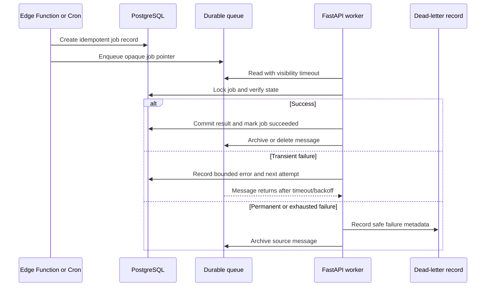

# Queue Processing

> **Status:** Target operational design. Queue creation, worker execution,
> retries, and Cron schedules remain pending verification.

## Why queues are used

Document extraction, report generation, risk recalculation, and notification
delivery are slower or more failure-prone than an ordinary authenticated
command. A durable queue separates user acknowledgement from background
completion without losing work.

## Queue contract

Messages contain only:

```json
{
  "job_id": "opaque-uuid",
  "job_type": "process_document",
  "resource_id": "opaque-uuid",
  "correlation_id": "opaque-uuid",
  "attempt": 0,
  "requested_at": "2026-07-24T10:00:00Z"
}
```

They do not contain document bodies, questionnaire responses, internal notes,
tokens, signed URLs, or service credentials.

## Processing sequence



## Idempotency

Each job type defines a stable key:

| Job | Key |
| --- | --- |
| Process document | Document-version ID plus object SHA-256 |
| Recalculate risk | Assessment snapshot ID plus calculation version |
| Generate report | Assessment decision ID plus template version |
| Deliver notification | Notification ID plus channel |
| Expiry reminder | Document-version ID plus reminder window and due date |

Workers check prior completion before external or mutating work. A repeated job
returns the prior result when safe.

## Retry classification

| Class | Example | Action |
| --- | --- | --- |
| Validation | Unsupported MIME or missing record | Permanent failure; no blind retry |
| Authorization/state | Suspended relationship or superseded version | Permanent or cancelled |
| Transient dependency | Storage timeout | Bounded retry |
| Rate limit | Optional email provider throttling | Retry after provider delay |
| Worker defect | Unexpected exception | Bounded retry, then dead-letter |

Store a bounded error code and summary. Do not persist raw document text or an
unbounded stack trace.

## Timing parameters

Exact values must follow measured workload. Initial configuration should define:

- visibility timeout
- maximum attempts
- minimum and maximum backoff
- per-job wall-clock timeout
- queue-age alert threshold
- dead-letter retention

Values belong in code or environment configuration and deployment reports, not
only prose.

## Cron responsibilities

Cron should enqueue bounded work for:

- expiring documents
- overdue assessments
- overdue findings
- corrective-action due dates
- invitation expiry
- notification retry
- abandoned upload cleanup

Cron must not run high-frequency full-table scans. Queries should use indexed due
dates and a stable cursor or bounded batch.

## Recovery

The operational runbook is
[`queue-recovery-runbook.md`](../operations/queue-recovery-runbook.md).
Recovery never means deleting all messages or replaying an unbounded queue.

## Required tests

- message remains after worker interruption
- success is acknowledged only after durable result
- duplicate message returns one logical result
- transient error retries
- permanent error does not loop
- exhausted error creates a dead-letter record
- logs and payloads contain no protected data
- two workers do not process the same visible job concurrently
- Cron rerun does not create duplicate reminders
