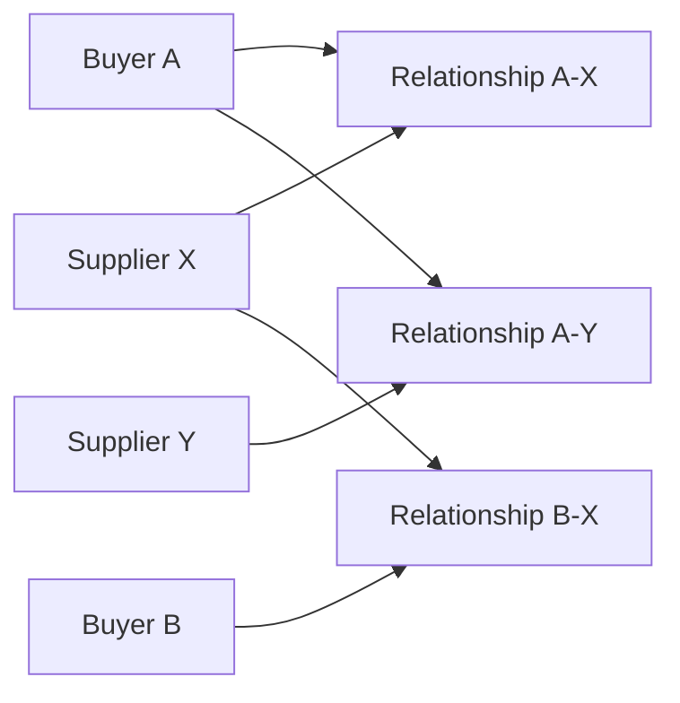
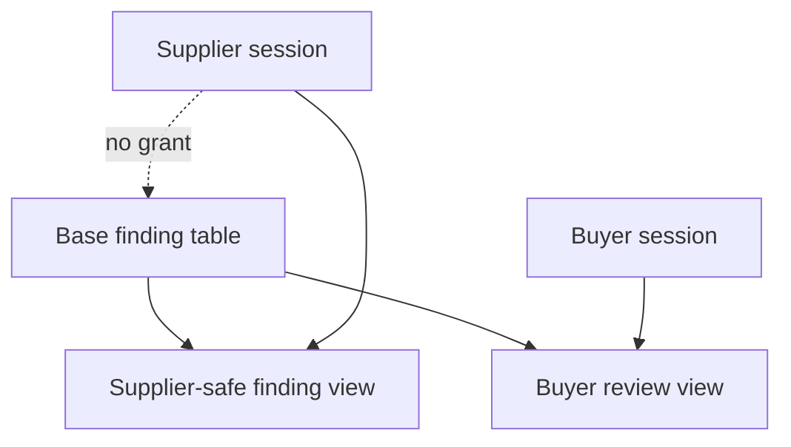

# Relationship-Based Authorization

> **Status:** Design contract. SQL helpers, policies, grants, and tests remain
> pending implementation.

## Why organization filtering is insufficient

Supplier qualification is shared between two organizations:

- the buyer that owns the qualification program and decision
- the supplier that provides answers and evidence

A buyer may work with many suppliers. A supplier may work with many buyers. A
user may also belong to multiple organizations with a different role in each.
Access therefore cannot be inferred from a single tenant selected in browser
state.



A Supplier Y user may access relationship A-Y but must not infer or access A-X.
A Supplier X user may access A-X and B-X only while the relevant membership and
relationship are active.

## Authorization inputs

Every decision uses server-derived state:

1. authenticated user ID
2. active organization membership
3. organization type
4. role within that organization
5. buyer-supplier relationship identity and status
6. assignment, where required
7. workflow state
8. requested action
9. field visibility

Client-supplied organization, relationship, role, and assignment values are
lookups, not authorization facts.

## Access matrix

| Resource/action | Buyer owner/admin | Assigned buyer reviewer | Supplier owner/admin | Supplier contributor | Viewer |
| --- | --- | --- | --- | --- | --- |
| Read own relationship | Yes | Yes | Yes | Yes | Read only |
| Manage buyer members | Yes | No | No | No | No |
| Publish program | Yes | No | No | No | No |
| Edit supplier draft answers | No | No | Yes | Assigned drafts | No |
| Submit assessment | Configured authorized role | No | Yes | No by default | No |
| Read evidence | Yes | Assigned review | Yes | Own relationship | Read only if policy permits |
| Read buyer internal note | Yes | Assigned review | No | No | Buyer viewer only if explicitly permitted |
| Raise finding | Authorized buyer role | Assigned review | No | No | No |
| Submit corrective action | No | No | Yes | Assigned finding | No |
| Record decision | Authorized decision-maker | Recommendation only by default | No | No | No |

The implementation should encode explicit role sets rather than rely on
lexicographic comparison of role names.

## Policy pattern

For a relationship-owned row:

```text
authenticated user
AND active membership
AND (
  membership.organization_id = relationship.buyer_organization_id
  OR membership.organization_id = relationship.supplier_organization_id
)
AND relationship.status permits requested action
AND role permits requested action
AND assignment permits requested action when assignment is required
```

Rows with an indirect path should contain `supplier_relationship_id` directly
when that reduces ambiguity and improves policy performance.

## Helper-function rules

Authorization helpers should:

- live in a nonpublic schema where practical
- receive resource IDs, not a caller-controlled user ID
- use `auth.uid()` internally
- return a Boolean or narrow role value
- set `search_path` explicitly
- schema-qualify referenced objects
- avoid dynamic SQL
- revoke public execution by default
- grant only to required API roles

Example signature shapes:

```sql
security.is_active_member(target_organization_id uuid) returns boolean
security.can_access_relationship(target_relationship_id uuid) returns boolean
security.is_assigned_reviewer(target_assessment_id uuid) returns boolean
```

These are illustrative signatures, not executed migrations.

## Field confidentiality

RLS decides whether a row can be selected. It does not remove columns. Supplier
access to collaborative rows therefore requires a separate query contract:



The supplier-safe result omits:

- buyer internal notes
- internal risk details
- internal decision rationale
- private reviewer metadata

Tests should assert protected keys are absent from the response shape.

## Relationship suspension

Suspension blocks ordinary supplier access and mutation but does not delete:

- assessment history
- submitted snapshots
- document versions
- findings and corrective actions
- decisions
- audit events

Narrow buyer access may continue for legal or operational review. Reinstatement
must be an authorized, audited transition.

## Assignment

Assignment is an additional restriction, not a replacement for membership:

- A buyer reviewer must remain an active buyer member.
- A supplier contributor must remain an active supplier member.
- Reassignment does not rewrite historical actor attribution.
- Removed assignees lose future mutation rights immediately.

## Performance considerations

RLS helpers execute on every relevant query. Required indexes include:

- active membership by user and organization
- relationships by buyer and supplier organization
- assessments by relationship and reviewer
- findings by relationship and supplier assignee

Policies should avoid repeated unindexed joins and volatile helper calls.
Representative `EXPLAIN (ANALYZE, BUFFERS)` output belongs in performance
evidence after implementation.

## Required negative tests

- anonymous access
- Buyer A to Buyer B relationship
- Supplier X to Supplier Y relationship under the same buyer
- inactive membership
- suspended relationship
- stale assignment
- supplier direct base-table query for internal fields
- viewer mutation
- self-role escalation
- direct URL with a valid-looking foreign UUID
- private Realtime subscription for another relationship
