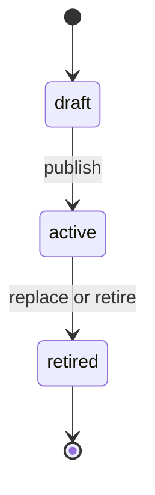
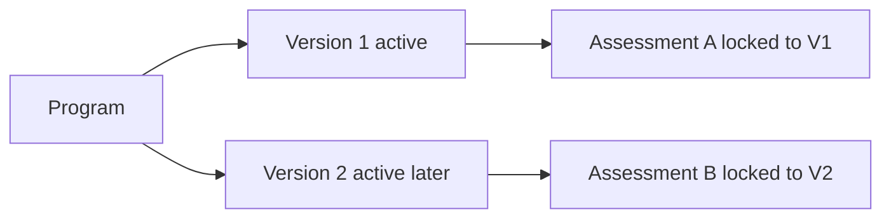
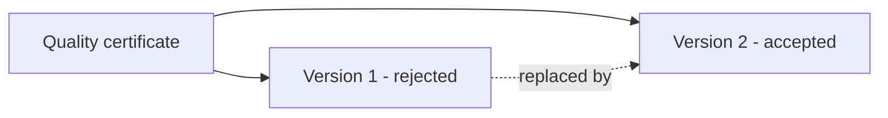

# Versioning and Immutability

> **Status:** Target behavior. Database enforcement and regression tests remain
> pending.

## Goals

- Reproduce the requirements used for any historical assessment.
- Reproduce the supplier evidence used for a review and decision.
- Prevent silent rewriting after submission.
- Permit corrections through explicit, traceable versions.
- Keep risk calculations and decisions historically explainable.

## Version families

| Record family | Mutable stage | Immutable stage | Change mechanism |
| --- | --- | --- | --- |
| Program definition | Draft version | Published or retired version | Create next version |
| Assessment responses | Draft/in-progress response | Submission snapshot | Resume allowed draft or create resubmission snapshot |
| Document evidence | Pending upload metadata | Ready/reviewed version | Upload next document version |
| Risk evaluation | Never edited after calculation | Every completed evaluation | Insert next calculation version |
| Approval decision | Never edited after recording | Every decision | Append superseding decision if policy allows |
| Audit event | None for ordinary users | At insertion | Append corrective event |

## Program lifecycle

Publishing should:

1. lock the draft version
2. validate sections, questions, options, and requirements
3. mark a prior active version retired where policy requires
4. set the program's current version
5. append an audit event
6. reject later definition mutation

Stable question and requirement keys allow comparison across versions without
reusing row IDs.

## Assessment locking

When an assessment is created:

- it records `qualification_program_id`
- it records exact `program_version_id`
- responses may reference only questions from that version
- document requirements come from that version
- publishing a later version does not change the assessment

## Submission snapshots

The mutable response table supports draft work. Submission creates an immutable
snapshot containing:

- submission number
- program version
- normalized response values
- exact ready document-version references
- supplier declaration
- submitting actor
- submitted timestamp
- deterministic content hash

A later changes-requested cycle produces a new snapshot. Review findings and
decisions should identify the relevant snapshot.

## Document lineage

The logical document groups versions. A version describes one immutable Storage
object. Replacement never writes to the prior path.

## Risk and decision history

Risk rules may evolve. Every evaluation records:

- calculation version
- input snapshot or assessment reference
- deterministic scoring breakdown
- resulting score and level
- calculation actor type
- timestamp

A new calculation supersedes but does not update the prior row.

Approval decisions record the authorized decision-maker, effective period,
conditions, internal rationale, and exact assessment snapshot. Corrections use a
new decision record with an explicit relationship to the prior decision.

## Immutability enforcement

Application controls are insufficient. Recommended database controls:

- deny ordinary `UPDATE` and `DELETE` grants
- RLS `WITH CHECK` rules for mutable draft states
- triggers that reject changes to published definitions
- controlled functions for publish, submit, supersede, and decide
- audit append in the same transaction

Triggers should return clear error codes and be covered by direct database tests.

## Required tests

- publish succeeds only for authorized buyer role
- published rows reject update and delete
- version 2 does not alter version 1 assessments
- snapshot hash is stable for equivalent normalized content
- snapshot rejects update and delete
- replacement creates version 2 and preserves version 1
- duplicate finalize does not create version 3
- risk recalculation inserts a new row
- decision mutation is denied
- concurrent version allocation remains unique
