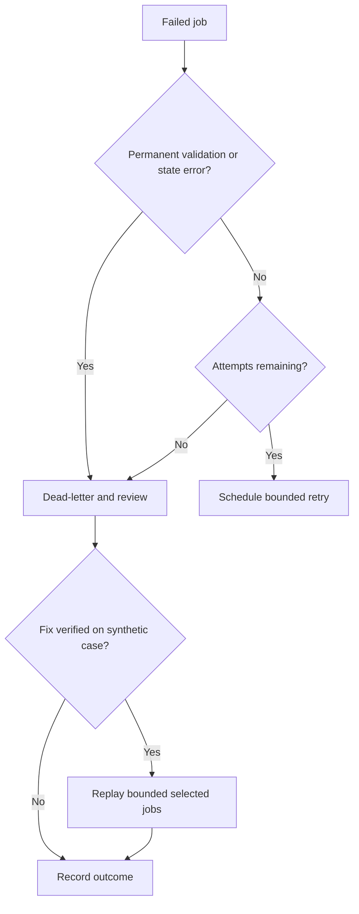

# Queue and Recovery Runbook

> Use only after queue implementation exists. Commands and provider-specific
> procedures must be added from verified deployment configuration.

## Signals

Investigate when:

- oldest visible message age exceeds threshold
- retry count rises
- dead-letter count rises
- worker readiness fails
- document versions remain `processing`
- reports remain pending
- reminders stop appearing

## Triage

1. Identify queue and affected job type.
2. Record correlation IDs and bounded error codes.
3. Check worker health and recent deployment.
4. Confirm dependency health without printing credentials.
5. Separate transient failures from deterministic validation failures.
6. Estimate affected relationship count using aggregate queries.

## Safe actions

- Pause the specific consumer.
- Fix configuration or code.
- Verify the fix against one synthetic job.
- Replay a bounded reviewed set.
- Confirm idempotency and one logical result.
- Resume while monitoring queue age and dead letters.

## Prohibited shortcuts

- Do not purge an entire queue to clear an alert.
- Do not replay every dead-letter message automatically.
- Do not paste document contents, tokens, or signed URLs into incident notes.
- Do not change job status directly without an audited recovery procedure.
- Do not increase retries indefinitely.

## Recovery decision

## Evidence to retain

- deployment version
- queue and job type
- correlation IDs
- counts, not protected payloads
- root cause
- fix and verification command
- jobs replayed
- final queue age and dead-letter count
- follow-up test or alert improvement
