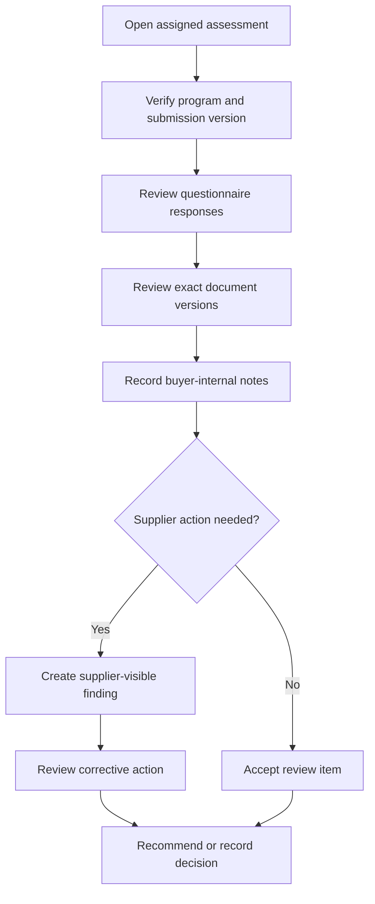

# Buyer Reviewer Workflow

This guide defines intended product behavior for a fictional buyer reviewer. It
is not proof that the UI or commands are implemented.

## Review entry conditions

- reviewer has active membership in the buyer organization
- reviewer is assigned to the assessment or has an explicitly authorized role
- supplier relationship is visible to the buyer
- assessment is `submitted`, `resubmitted`, or `under_review`
- submission snapshot exists

## Review sequence

## Reviewer checklist

- Confirm the assessment uses the expected program version.
- Review the immutable submission snapshot, not a later draft.
- Open only exact document versions linked to the snapshot.
- Keep supplier-facing and internal comments in separate fields.
- Use a specific severity, category, and due date for findings.
- Do not include secrets or unnecessary personal information in notes.
- Confirm corrective evidence addresses the stated finding.
- Check unresolved blocking findings before recommending a decision.
- Record factual rationale and avoid unsupported claims.

## Finding quality

A supplier-visible finding should include:

- what requirement was not met
- objective evidence reference
- expected correction
- due date
- severity and category

An internal note may explain review strategy but must never be copied into a
supplier response automatically.

## Decision handoff

The reviewer may recommend a decision. Only a role explicitly authorized by the
database action map records a final decision. The command verifies unresolved
findings and writes the decision and assessment transition atomically.
